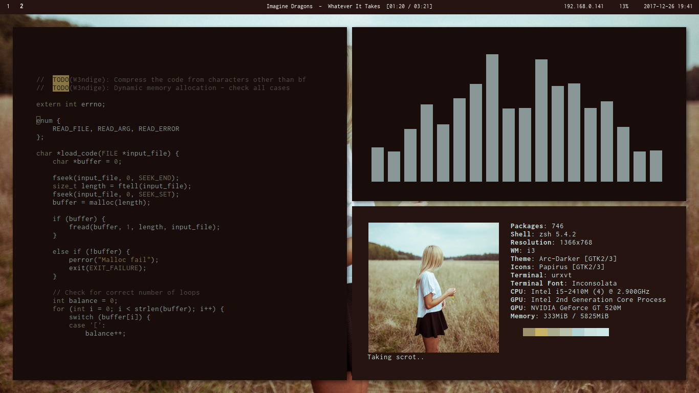

# W3ndige does dotfiles too!

My small dotfiles, that are used to personalize my `i3-gaps` system. I'm using [pywal](https://github.com/dylanaraps/pywal) to generate colorscheme based on the wallpaper, as I'm changing them probably as often as once a week.  

## Setup
- Font  `inconcolata`
- Icon Theme `papirus`
- GTK Theme `arc darker`
- Terminal Emulator `urxvt`
- Shell `zsh`
- Application Launcher `rofi`
- Bar `polybar`
- Text Editor `neovim` and `atom`
- Music player `cmus`

## Additional software
- Music Visualizer `cava`
- CLI System information Tool `neofetch`
- Lockscreen `betterlockscreen` 
